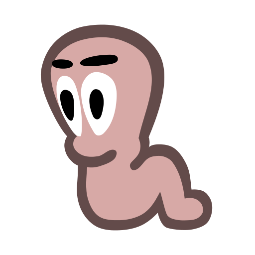
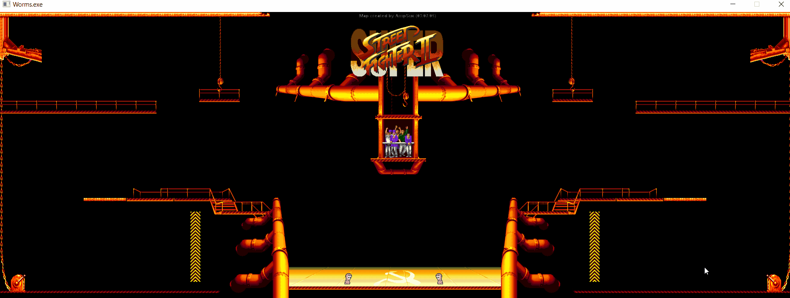

<h1 align="center">
    
     
    Worms
   
</h1>

<h3 align="center">A program made with C++</a></h3>

  <a href="#what-is-it">What it is</a> •
  <a href="#how-to-run">How to run</a> •
  <a href="#preview">Preview</a> •

 

## What it is

This project follows the rules found in the Purpose.pdf file provided by Algorithms and Data Structures Course 2020 (ITBA).

The idea behind this project is to create a graphical user interface with an event-oriented programming where the user moves 2 worms one with the arrow keys and the other with the keys: A, D, W.

The worms can moves inside the fighting ring, those can jump and moves at the same time with the same keyboard.

The animation is created with the images of the worm jumping and walking.

If two keys are pressed on the same Worms, priority will be given to the first one

In order for the worm to start moving, the player must keep the key pressed for more than 100ms. If the key is pressed for less time, the machine understands that the user wants to turn the selected worm on itself if it were the reverse arrow and it is ignored in another case.

the gravity of the word must be g=0.24 and the speed of the jump is 4.5 with an angle of 60 degrees.

The refresh rate is fixed at 50FPS (frames per second).

## How to Run

the easy way to run this example is open the solution with Visual Studio IDE and tapping Local Windows Debugging button. Another way is compiling the source code by hand with the command console.

Maybe you need to install the following packages to run or modify the app:

- Allegro.5.2.6
- AllegroDeps.1.11.0

You can install them easily from NuGet packages on visual studio

 

## Preview
 

